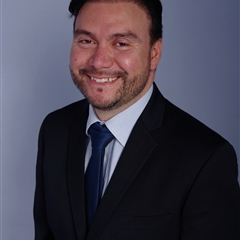

---
---

<link rel="stylesheet" href="styles.css" type="text/css">

Economista salvadoreño, mis áreas de especialización son: Macroeconomía, Mercado de Capitales, Banca y finanzas y econometría. 

Poseo un Magister en Economía y un Postgrado en Macroeconomía Aplicada otorgado por el [Instituto de Economía de la Pontificia Universidad Católica de Chile](https://economia.uc.cl). He trabajado en el  [Banco Central de Reserva de El Salvador](https://www.bcr.gob.sv/esp/) en las áreas de Estadísticas y Estabilidad Financiera. Actualmente laboro en la [Secretaría Ejecutiva del Consejo Monetario Centroaméricano](http://www.secmca.org/) coordinando el Informe de Estabilidad Financiera Regional y los Grupos regionales de: Estabilidad Financiera, Oficiales de Cumplimientos de Bancos Centrales y Estándares para el desarrollo de un mercado de deuda pública centroamericano.

Soy un ávido entusiasta del lenguaje R, impartiendo seminarios en ese lenguaje en los temas de gestión de riesgos para la banca comercial.

Si desea, puede descagar mi CV [aqui](files/CV.pdf).
